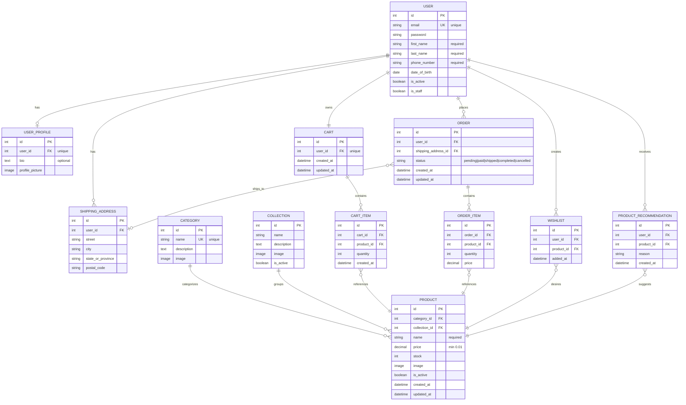

# 🏗️ Diagramas de Arquitectura Urban-Loom - Mermaid

Este archivo contiene todos los diagramas de arquitectura en formato **Mermaid**, listos para usar en GitHub, GitLab, Notion, Confluence y cualquier plataforma que soporte Mermaid.

---

## 📊 Índice de Diagramas

1. [Diagrama de Contexto (C4 - Nivel 1)](#1-diagrama-de-contexto-c4---nivel-1)
2. [Diagrama de Contenedores (C4 - Nivel 2)](#2-diagrama-de-contenedores-c4---nivel-2)
3. [Diagrama de Componentes - Accounts](#3-diagrama-de-componentes---accounts)
4. [Diagrama de Componentes - Catalog](#4-diagrama-de-componentes---catalog)
5. [Diagrama de Componentes - Orders](#5-diagrama-de-componentes---orders)
6. [Diagrama Entidad-Relación (ERD)](#6-diagrama-entidad-relación-erd)
7. [Arquitectura de Deployment AWS](#7-arquitectura-de-deployment-aws)
8. [Flujo de Compra (Secuencia)](#8-flujo-de-compra-secuencia)
9. [Pipeline CI/CD](#9-pipeline-cicd)
10. [Arquitectura de Red AWS](#10-arquitectura-de-red-aws)

---

## 1. Diagrama de Contexto (C4 - Nivel 1)

```mermaid
graph TB
    subgraph External["Sistemas Externos"]
        DockerHub["DockerHub<br/>Control de versiones<br/>de imágenes Docker"]
        Stripe["Stripe<br/>Procesamiento<br/>de pagos"]
        Email["Servicio de Email<br/>Emails transaccionales"]
    end
    
    Usuario["👤 Usuario<br/>Cliente de la tienda"]
    Admin["👤 Administrador<br/>Gestiona contenido"]
    
    UrbanLoom["🛍️ Urban-Loom Platform<br/>E-commerce de moda<br/>Django 4.2.23"]
    
    Usuario -->|"Navega, compra,<br/>gestiona cuenta"| UrbanLoom
    Admin -->|"Gestiona productos,<br/>categorías, pedidos"| UrbanLoom
    
    UrbanLoom -->|"Pull imagen<br/>urban-loom:latest"| DockerHub
    UrbanLoom -->|"Procesa pagos"| Stripe
    UrbanLoom -->|"Envía emails"| Email
    
    style Usuario fill:#08427b,stroke:#fff,color:#fff
    style Admin fill:#08427b,stroke:#fff,color:#fff
    style UrbanLoom fill:#1168bd,stroke:#fff,color:#fff
    style DockerHub fill:#999,stroke:#fff,color:#fff
    style Stripe fill:#999,stroke:#fff,color:#fff
    style Email fill:#999,stroke:#fff,color:#fff
```



---

## 2. Diagrama de Contenedores (C4 - Nivel 2)

```mermaid
graph TB
    Usuario["👤 Usuario"]
    
    subgraph UrbanLoom["Urban-Loom Platform"]
        WebApp["Web Application<br/>Django Templates<br/>Tailwind CSS + JS"]
        
        subgraph Django["Django Apps"]
            Accounts["Accounts App<br/>Autenticación<br/>y Perfiles"]
            Catalog["Catalog App<br/>Productos<br/>y Catálogo"]
            Orders["Orders App<br/>Carritos<br/>y Pedidos"]
            Recommendations["Recommendations App<br/>Wishlist y<br/>Recomendaciones"]
            Core["Core App<br/>Utilidades<br/>e i18n"]
        end
        
        DB[(PostgreSQL<br/>Database<br/>12 tablas)]
        Redis[("Redis Cache<br/>Sesiones<br/>y Caché")]
        
        Gunicorn["Gunicorn<br/>WSGI Server<br/>4 workers"]
        Nginx["Nginx<br/>Proxy Inverso<br/>SSL"]
    end
    
    subgraph AWS["AWS Services"]
        S3Static["S3 Bucket<br/>Static Files<br/>CSS, JS"]
        S3Media["S3 Bucket<br/>Media Files<br/>Imágenes"]
    end
    
    subgraph External["Externos"]
        Stripe["Stripe<br/>Pagos"]
    end
    
    Usuario -->|HTTPS| Nginx
    Nginx --> Gunicorn
    Gunicorn --> WebApp
    
    WebApp --> Accounts
    WebApp --> Catalog
    WebApp --> Orders
    WebApp --> Recommendations
    WebApp --> Core
    
    Accounts --> DB
    Catalog --> DB
    Orders --> DB
    Recommendations --> DB
    
    Accounts --> Redis
    Catalog --> Redis
    Orders --> Redis
    
    Accounts -->|boto3| S3Media
    Catalog -->|boto3| S3Media
    WebApp -->|HTTPS| S3Static
    
    Orders --> Stripe
    
    style Usuario fill:#08427b,stroke:#fff,color:#fff
    style WebApp fill:#438dd5,stroke:#fff,color:#fff
    style Accounts fill:#438dd5,stroke:#fff,color:#fff
    style Catalog fill:#438dd5,stroke:#fff,color:#fff
    style Orders fill:#438dd5,stroke:#fff,color:#fff
    style Recommendations fill:#438dd5,stroke:#fff,color:#fff
    style Core fill:#438dd5,stroke:#fff,color:#fff
    style DB fill:#3b48cc,stroke:#fff,color:#fff
    style Redis fill:#cc2264,stroke:#fff,color:#fff
    style Gunicorn fill:#27ae60,stroke:#fff,color:#fff
    style Nginx fill:#16a085,stroke:#fff,color:#fff
    style S3Static fill:#569a31,stroke:#fff,color:#fff
    style S3Media fill:#569a31,stroke:#fff,color:#fff
    style Stripe fill:#999,stroke:#fff,color:#fff
```



---

## 3. Diagrama de Componentes - Accounts

```mermaid
graph TB
    subgraph AccountsApp["Accounts App - Autenticación y Perfiles"]
        direction TB
        
        User["👤 User Model<br/>---<br/>+ email: EmailField<br/>+ password: CharField<br/>+ first_name: CharField<br/>+ last_name: CharField<br/>+ phone_number: CharField<br/>+ date_of_birth: DateField<br/>---<br/>+ is_active: Boolean<br/>+ is_staff: Boolean"]
        
        Profile["📋 UserProfile<br/>---<br/>+ user: OneToOne → User<br/>+ bio: TextField<br/>+ profile_picture: ImageField<br/>---<br/>+ created with post_save signal"]
        
        Address["📍 ShippingAddress<br/>---<br/>+ user: ForeignKey → User<br/>+ street: CharField<br/>+ city: CharField<br/>+ state_or_province: CharField<br/>+ postal_code: CharField"]
        
        Customer["💼 Customer<br/>---<br/>Hereda de User<br/>proxy model"]
        
        AuthViews["🔐 Authentication Views<br/>---<br/>+ LoginView<br/>+ LogoutView<br/>+ RegisterView<br/>---<br/>Gestiona autenticación"]
        
        ProfileViews["👥 Profile Views<br/>---<br/>+ ProfileView<br/>+ EditProfileView<br/>---<br/>Gestiona perfil de usuario"]
        
        AddressViews["🏠 Address Views<br/>---<br/>+ AddAddressView<br/>+ EditAddressView<br/>+ DeleteAddressView<br/>+ ListAddressesView<br/>---<br/>CRUD de direcciones"]
        
        UserForms["📝 User Forms<br/>---<br/>+ UserRegistrationForm<br/>+ UserLoginForm<br/>+ ProfileForm<br/>+ AddressForm<br/>---<br/>Validaciones y limpieza"]
    end
    
    DB[("💾 PostgreSQL<br/>---<br/>accounts_user<br/>accounts_userprofile<br/>accounts_shippingaddress<br/>accounts_customer")]
    
    S3[("📦 S3 Bucket<br/>---<br/>profiles/<br/>avatars/")]
    
    AuthViews -->|"Crea/valida"| User
    ProfileViews -->|"Lee/actualiza"| Profile
    AddressViews -->|"CRUD"| Address
    UserForms -->|"Valida datos"| User
    
    User -->|"1:1 post_save signal"| Profile
    User -->|"1:N"| Address
    Customer -->|"extends (proxy)"| User
    
    User -->|"INSERT/UPDATE"| DB
    Profile -->|"INSERT/UPDATE"| DB
    Address -->|"INSERT/UPDATE"| DB
    
    Profile -->|"boto3 upload"| S3
    
    style User fill:#85bbf0,stroke:#000,stroke-width:2px
    style Profile fill:#85bbf0,stroke:#000,stroke-width:2px
    style Address fill:#85bbf0,stroke:#000,stroke-width:2px
    style Customer fill:#85bbf0,stroke:#000,stroke-width:2px
    style AuthViews fill:#ffd700,stroke:#000,stroke-width:2px
    style ProfileViews fill:#ffd700,stroke:#000,stroke-width:2px
    style AddressViews fill:#ffd700,stroke:#000,stroke-width:2px
    style UserForms fill:#98fb98,stroke:#000,stroke-width:2px
    style DB fill:#3b48cc,stroke:#fff,stroke-width:3px,color:#fff
    style S3 fill:#569a31,stroke:#fff,stroke-width:3px,color:#fff
```



---

## 4. Diagrama de Componentes - Catalog

```mermaid
graph LR
    subgraph CatalogApp["Catalog App - Productos y Catálogo"]
        direction TB
        
        subgraph Models["Models"]
            Product["Product<br/>name, price, stock<br/>Validación: price >= 0.01"]
            Category["Category<br/>name, description"]
            Collection["Collection<br/>name, is_active"]
        end
        
        subgraph Views["Views"]
            CatalogViews["Catalog Views<br/>shop, products,<br/>collections"]
            ProductsAPI["Products API<br/>JSON REST<br/>/api/products/"]
        end
        
        CatalogViews --> Product
        CatalogViews --> Category
        CatalogViews --> Collection
        ProductsAPI --> Product
        
        Category -.->|"1:N<br/>ForeignKey"| Product
        Collection -.->|"1:N<br/>ForeignKey"| Product
    end
    
    DB[(PostgreSQL<br/>catalog_*)]
    S3[(S3 Bucket<br/>products/,<br/>categories/)]
    
    Product --> DB
    Category --> DB
    Collection --> DB
    Product -->|boto3| S3
    
    style Product fill:#85bbf0,stroke:#000
    style Category fill:#85bbf0,stroke:#000
    style Collection fill:#85bbf0,stroke:#000
    style CatalogViews fill:#85bbf0,stroke:#000
    style ProductsAPI fill:#85bbf0,stroke:#000
    style DB fill:#3b48cc,stroke:#fff,color:#fff
    style S3 fill:#569a31,stroke:#fff,color:#fff
```



---

## 5. Diagrama de Componentes - Orders


---

## 6. Diagrama Entidad-Relación (ERD)



---

## 7. Arquitectura de Deployment AWS

```mermaid
graph TB
    subgraph Internet["Internet"]
        Users["👥 Usuarios"]
    end
    
    subgraph AWS["AWS Cloud"]
        Route53["Route 53<br/>DNS<br/>urbanloom.com"]
        CloudFront["CloudFront<br/>CDN<br/>Distribución global"]
        
        subgraph VPC["VPC"]
            ALB["Application Load Balancer<br/>SSL Termination<br/>Health Checks"]
            
            subgraph ECS["ECS Cluster"]
                Task1["Fargate Task 1<br/>Django + Gunicorn<br/>+ Nginx"]
                Task2["Fargate Task 2<br/>Django + Gunicorn<br/>+ Nginx"]
            end
            
            subgraph Data["Data Layer"]
                RDS[("RDS PostgreSQL<br/>Multi-AZ<br/>Backups automáticos")]
                ElastiCache[("ElastiCache Redis<br/>Sesiones y Caché")]
            end
        end
        
        subgraph Storage["Storage"]
            S3Static["S3 Bucket<br/>Static Files<br/>CloudFront Origin"]
            S3Media["S3 Bucket<br/>Media Files<br/>Profile pics, Products"]
        end
        
        subgraph Monitoring["Monitoring & Security"]
            CloudWatch["CloudWatch<br/>Logs & Metrics<br/>Alarmas"]
            IAM["IAM<br/>Roles & Policies<br/>Least Privilege"]
            Secrets["Secrets Manager<br/>DB Credentials<br/>API Keys"]
        end
    end
    
    subgraph External["External Services"]
        DockerHub["DockerHub<br/>urban-loom:latest<br/>Version Control"]
        Stripe["Stripe<br/>Payment Gateway"]
    end
    
    Users -->|HTTPS| Route53
    Route53 --> CloudFront
    CloudFront --> ALB
    CloudFront --> S3Static
    
    ALB --> Task1
    ALB --> Task2
    
    Task1 --> RDS
    Task2 --> RDS
    Task1 --> ElastiCache
    Task2 --> ElastiCache
    Task1 --> S3Media
    Task2 --> S3Media
    Task1 --> Stripe
    Task2 --> Stripe
    
    Task1 --> CloudWatch
    Task2 --> CloudWatch
    Task1 --> Secrets
    Task2 --> Secrets
    
    DockerHub -.->|Pull Image| Task1
    DockerHub -.->|Pull Image| Task2
    
    IAM -.->|Access Control| Task1
    IAM -.->|Access Control| Task2
    IAM -.->|Access Control| S3Static
    IAM -.->|Access Control| S3Media
    
    style Users fill:#08427b,stroke:#fff,color:#fff
    style Route53 fill:#c44536,stroke:#fff,color:#fff
    style CloudFront fill:#8c4fff,stroke:#fff,color:#fff
    style ALB fill:#8c4fff,stroke:#fff,color:#fff
    style Task1 fill:#ff9900,stroke:#fff,color:#fff
    style Task2 fill:#ff9900,stroke:#fff,color:#fff
    style RDS fill:#3b48cc,stroke:#fff,color:#fff
    style ElastiCache fill:#cc2264,stroke:#fff,color:#fff
    style S3Static fill:#569a31,stroke:#fff,color:#fff
    style S3Media fill:#569a31,stroke:#fff,color:#fff
    style CloudWatch fill:#e7157b,stroke:#fff,color:#fff
    style IAM fill:#dd344c,stroke:#fff,color:#fff
    style Secrets fill:#dd344c,stroke:#fff,color:#fff
    style DockerHub fill:#2496ed,stroke:#fff,color:#fff
    style Stripe fill:#999,stroke:#fff,color:#fff
```



---

## 8. Flujo de Compra (Secuencia)

```mermaid
sequenceDiagram
    actor Usuario
    participant Web as Web App
    participant Catalog as Catalog App
    participant Orders as Orders App
    participant DB as PostgreSQL
    participant Stripe
    participant Email as Email Service
    
    Usuario->>Web: 1. Navega al producto
    Web->>Catalog: 2. Obtiene detalle
    Catalog->>DB: 3. Query producto
    DB-->>Catalog: 4. Retorna datos
    Catalog-->>Web: 5. Renderiza detalle
    Web-->>Usuario: 6. Muestra producto
    
    Usuario->>Web: 7. Agrega al carrito
    Web->>Orders: 8. Agrega item
    Orders->>DB: 9. INSERT CartItem
    DB-->>Orders: 10. Confirmación
    Orders-->>Web: 11. Item agregado
    Web-->>Usuario: 12. Actualiza carrito
    
    Usuario->>Web: 13. Ir a checkout
    Web->>Orders: 14. Procesar checkout
    Orders->>DB: 15. CREATE Order + OrderItems
    DB-->>Orders: 16. Order creada
    
    Orders->>Stripe: 17. Procesa pago
    Stripe-->>Orders: 18. Pago confirmado
    
    Orders->>DB: 19. UPDATE Order (status=paid)
    Orders->>Email: 20. Envía confirmación
    Email-->>Usuario: 21. Email recibido
    
    Orders-->>Web: 22. Orden confirmada
    Web-->>Usuario: 23. Página de confirmación
    
    Note over Usuario,Email: Flujo completo: 18 pasos<br/>Tiempo promedio: 2-3 segundos
```



---

## 9. Pipeline CI/CD

```mermaid
sequenceDiagram
    actor Dev as Developer
    participant GitHub
    participant Actions as GitHub Actions
    participant Docker
    participant Hub as DockerHub
    participant AWS as AWS ECS
    participant RDS as PostgreSQL
    participant Monitor as CloudWatch
    
    Dev->>GitHub: 1. git push origin main
    GitHub->>Actions: 2. Trigger workflow
    
    rect rgb(240, 248, 255)
        Note over Actions: Build & Test Phase
        Actions->>Actions: 3. Checkout code
        Actions->>Actions: 4. Setup Python 3.11
        Actions->>Actions: 5. Install dependencies
        Actions->>Actions: 6. Run 53 tests
        Actions->>Actions: 7. Check coverage (76%)
    end
    
    alt Tests Pass
        rect rgb(240, 255, 240)
            Note over Actions,Hub: Docker Build Phase
            Actions->>Docker: 8. Build image
            Docker->>Docker: 9. docker build -t urban-loom
            Docker->>Hub: 10. Push urban-loom:latest
            Hub-->>Docker: 11. Image pushed
        end
        
        rect rgb(255, 248, 240)
            Note over Actions,Monitor: AWS Deployment Phase
            Actions->>AWS: 12. Update ECS service
            AWS->>Hub: 13. Pull urban-loom:latest
            Hub-->>AWS: 14. Image downloaded
            AWS->>AWS: 15. Start new tasks (Rolling update)
            AWS->>RDS: 16. Run migrations
            RDS-->>AWS: 17. Migrations complete
            AWS->>AWS: 18. Health check (GET /health/)
            
            alt Health Check OK
                AWS->>AWS: 19. Route traffic to new tasks
                AWS->>AWS: 20. Stop old tasks
                AWS->>Monitor: 21. Log deployment success
                Monitor-->>Dev: 22. ✅ Deployment successful
            else Health Check Fail
                AWS->>AWS: 23. Rollback to previous version
                AWS->>Monitor: 24. Log deployment failure
                Monitor-->>Dev: 25. ❌ Deployment failed
            end
        end
    else Tests Fail
        Actions-->>Dev: 26. ❌ Build failed - Fix tests
    end
    
    Note over Dev,Monitor: Pipeline completo: ~5-10 minutos<br/>Rolling update: Zero downtime
```



---

## 10. Arquitectura de Red AWS

```mermaid
graph TB
    subgraph Internet["Internet"]
        Users["👥 Usuarios<br/>Clientes de Urban-Loom"]
    end
    
    subgraph AWS["AWS Cloud - Region: us-east-1"]
        Route53["🌐 Route 53<br/>DNS Management<br/>urbanloom.com"]
        CloudFront["📡 CloudFront CDN<br/>Edge Locations Globales<br/>Caché de contenido estático"]
        
        subgraph VPC["VPC - 10.0.0.0/16"]
            subgraph PublicSubnet["Public Subnets"]
                ALB["⚖️ Application Load Balancer<br/>SSL/TLS Termination<br/>Target Groups"]
                NAT["🔄 NAT Gateway<br/>Salida a Internet"]
            end
            
            subgraph PrivateSubnet1["Private Subnet AZ-1"]
                ECS1["🐳 ECS Task 1<br/>Django App<br/>Fargate"]
            end
            
            subgraph PrivateSubnet2["Private Subnet AZ-2"]
                ECS2["🐳 ECS Task 2<br/>Django App<br/>Fargate"]
            end
            
            subgraph DataSubnet1["Data Subnet AZ-1"]
                RDSPrimary[("💾 RDS Primary<br/>PostgreSQL 15<br/>db.t3.micro")]
            end
            
            subgraph DataSubnet2["Data Subnet AZ-2"]
                RDSStandby[("💾 RDS Standby<br/>Multi-AZ<br/>Sync Replication")]
                ElastiCache[("🔴 ElastiCache<br/>Redis 7<br/>cache.t3.micro")]
            end
            
            SecurityGroup["🔒 Security Groups<br/>- ALB: 80, 443<br/>- ECS: 8000<br/>- RDS: 5432<br/>- Redis: 6379"]
        end
        
        subgraph Storage["S3 Storage"]
            S3Static["📦 S3 Bucket (Static)<br/>CSS, JS, Images<br/>CloudFront Origin"]
            S3Media["📦 S3 Bucket (Media)<br/>User Uploads<br/>Products, Profiles"]
        end
        
        subgraph Monitoring["Monitoring & Security"]
            CloudWatch["📊 CloudWatch<br/>- Application Logs<br/>- Metrics & Alarms<br/>- Auto-scaling Triggers"]
            IAM["🔐 IAM<br/>- ECS Task Role<br/>- S3 Access Policies<br/>- RDS Access"]
            Secrets["🔑 Secrets Manager<br/>- DB Password<br/>- Django SECRET_KEY<br/>- API Keys"]
        end
    end
    
    subgraph External["External Services"]
        DockerHub["🐋 DockerHub<br/>urban-loom:latest<br/>Image Registry"]
        Stripe["💳 Stripe API<br/>Payment Processing"]
        GitHub["🐙 GitHub<br/>Source Code<br/>CI/CD Triggers"]
    end
    
    Users -->|"HTTPS<br/>443"| Route53
    Route53 -->|"DNS Resolution"| CloudFront
    CloudFront -->|"Cache Miss"| ALB
    CloudFront -->|"Cache Hit"| S3Static
    
    ALB -->|"HTTP 8000"| ECS1
    ALB -->|"HTTP 8000"| ECS2
    
    ECS1 -->|"psycopg2<br/>5432"| RDSPrimary
    ECS2 -->|"psycopg2<br/>5432"| RDSPrimary
    ECS1 -->|"django-redis<br/>6379"| ElastiCache
    ECS2 -->|"django-redis<br/>6379"| ElastiCache
    
    RDSPrimary -.->|"Sync Replication"| RDSStandby
    
    ECS1 -->|"boto3<br/>HTTPS"| S3Media
    ECS2 -->|"boto3<br/>HTTPS"| S3Media
    
    ECS1 -->|"HTTPS API"| Stripe
    ECS2 -->|"HTTPS API"| Stripe
    
    ECS1 --> NAT
    ECS2 --> NAT
    NAT -->|"Internet Access"| Internet
    
    ECS1 -.->|"Logs"| CloudWatch
    ECS2 -.->|"Logs"| CloudWatch
    CloudWatch -.->|"Alarms"| Users
    
    IAM -.->|"Permissions"| ECS1
    IAM -.->|"Permissions"| ECS2
    Secrets -.->|"Credentials"| ECS1
    Secrets -.->|"Credentials"| ECS2
    
    DockerHub -.->|"Pull Image"| ECS1
    DockerHub -.->|"Pull Image"| ECS2
    
    GitHub -.->|"CI/CD"| DockerHub
    
    style Users fill:#08427b,stroke:#fff,color:#fff
    style Route53 fill:#c44536,stroke:#fff,color:#fff
    style CloudFront fill:#8c4fff,stroke:#fff,color:#fff
    style ALB fill:#8c4fff,stroke:#fff,color:#fff
    style ECS1 fill:#ff9900,stroke:#fff,color:#fff
    style ECS2 fill:#ff9900,stroke:#fff,color:#fff
    style RDSPrimary fill:#3b48cc,stroke:#fff,color:#fff
    style RDSStandby fill:#3b48cc,stroke:#fff,color:#fff
    style ElastiCache fill:#cc2264,stroke:#fff,color:#fff
    style S3Static fill:#569a31,stroke:#fff,color:#fff
    style S3Media fill:#569a31,stroke:#fff,color:#fff
    style CloudWatch fill:#e7157b,stroke:#fff,color:#fff
    style IAM fill:#dd344c,stroke:#fff,color:#fff
    style Secrets fill:#dd344c,stroke:#fff,color:#fff
    style SecurityGroup fill:#dd344c,stroke:#fff,color:#fff
    style NAT fill:#16a085,stroke:#fff,color:#fff
    style DockerHub fill:#2496ed,stroke:#fff,color:#fff
    style Stripe fill:#635bff,stroke:#fff,color:#fff
    style GitHub fill:#24292e,stroke:#fff,color:#fff
```



---

## 📖 Cómo Usar Estos Diagramas

### En GitHub / GitLab
Los diagramas se renderizan automáticamente en archivos Markdown:

```markdown
# Mi Documentación

## Arquitectura del Sistema

​```mermaid
graph TB
    A[Cliente] --> B[Servidor]
​```
```

### En Notion
1. Crear bloque de código
2. Seleccionar lenguaje "Mermaid"
3. Pegar el código del diagrama

### En Confluence
1. Instalar el plugin "Mermaid Diagrams"
2. Agregar macro Mermaid
3. Pegar el código

### En VS Code
1. Instalar extensión "Markdown Preview Mermaid Support"
2. Abrir preview del markdown (Ctrl+Shift+V)

### Exportar como Imagen
Usar el editor online de Mermaid:
1. Ir a: https://mermaid.live/
2. Pegar el código
3. Descargar como PNG/SVG

---

## 🎨 Personalización

### Cambiar Colores


### Agregar Íconos (Unicode)

```mermaid
graph TB
    A["👤 Usuario"]
    B["🛍️ Tienda"]
    C["💾 Base de Datos"]
```


### Orientación de Diagramas
- `graph TB` - Top to Bottom
- `graph LR` - Left to Right
- `graph BT` - Bottom to Top
- `graph RL` - Right to Left

---

## 📊 Ventajas de Mermaid

| Característica | Ventaja |
|----------------|---------|
| **Nativo en GitHub** | ✅ Renderiza automáticamente |
| **Texto plano** | ✅ Fácil versionado en Git |
| **Colaboración** | ✅ Pull requests con diffs visuales |
| **Mantenimiento** | ✅ Editar código = actualizar diagrama |
| **Exportación** | ✅ PNG, SVG desde mermaid.live |
| **Integración** | ✅ GitHub, GitLab, Notion, Confluence |

---

## 🔗 Referencias

- **Documentación Mermaid:** https://mermaid.js.org/
- **Editor Online:** https://mermaid.live/
- **Sintaxis C4:** https://mermaid.js.org/syntax/c4.html
- **Sintaxis ERD:** https://mermaid.js.org/syntax/entityRelationshipDiagram.html
- **Sintaxis Secuencia:** https://mermaid.js.org/syntax/sequenceDiagram.html

---

**Archivo creado:** `architecture-mermaid.md`  
**Diagramas incluidos:** 10  
**Compatible con:** GitHub, GitLab, Notion, Confluence, VS Code  
**Última actualización:** 6 de noviembre de 2025
